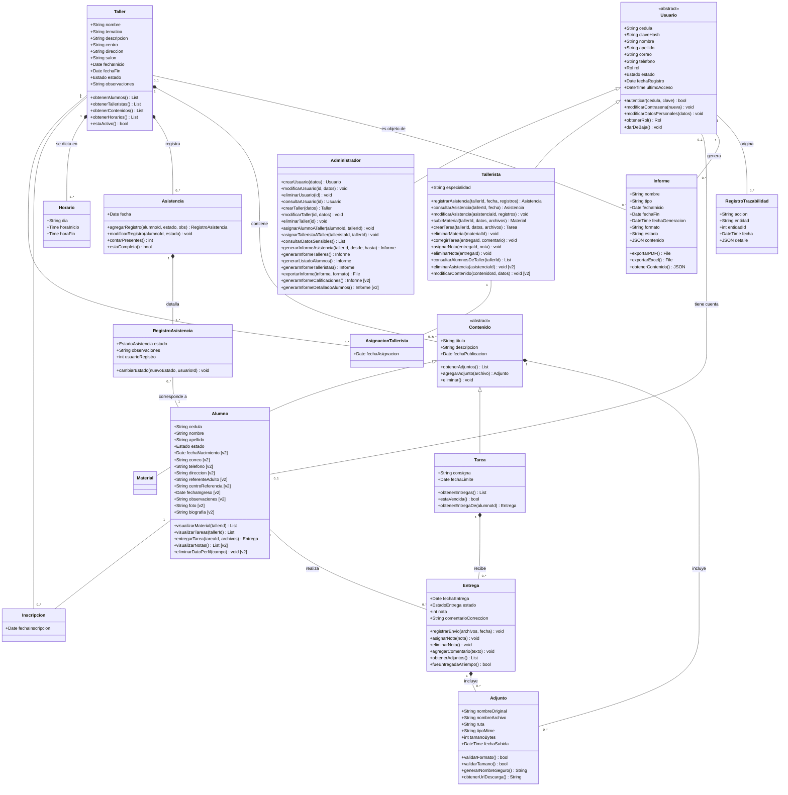

# Modelo de Clases UML

## Sistema de Gestión de Talleres en Convenio con INAU

Este documento presenta el modelo de clases resultante y su traducción al modelo relacional. La derivación completa a partir de los requerimientos, con la justificación de cada decisión, se encuentra en el documento *Anexo — Derivación del modelo de clases*.

> **Convención:** los elementos derivados de requerimientos excluidos de la primera versión se señalan con **(v2)**. Se incorporan al modelo para que la estructura no requiera rediseño al implementar la fase 2.

---

## 1. Clases del modelo

### 1.1 Usuario *(abstracta)*

| Atributos | Métodos |
|---|---|
| `cedula`, `claveHash`, `nombre`, `apellido`, `correo`, `telefono`, `rol`, `estado`, `fechaRegistro`, `ultimoAcceso` | `autenticar()`, `modificarContrasena()`, `modificarDatosPersonales()`, `obtenerRol()`, `darDeBaja()` |

### 1.2 Administrador *(hereda de Usuario)*

| Atributos | Métodos |
|---|---|
| — | `crearUsuario()`, `modificarUsuario()`, `eliminarUsuario()`, `consultarUsuario()`, `crearTaller()`, `modificarTaller()`, `eliminarTaller()`, `asignarAlumnoATaller()`, `asignarTalleristaATaller()`, `consultarDatosSensibles()`, `generarInformeAsistencia()`, `generarInformeTalleres()`, `generarListadoAlumnos()`, `generarInformeTalleristas()`, `exportarInforme()`, `generarInformeCalificaciones()` **(v2)**, `generarInformeDetalladoAlumnos()` **(v2)** |

### 1.3 Tallerista *(hereda de Usuario)*

| Atributos | Métodos |
|---|---|
| `especialidad` | `registrarAsistencia()`, `consultarAsistencia()`, `modificarAsistencia()`, `subirMaterial()`, `crearTarea()`, `eliminarMaterial()`, `corregirTarea()`, `asignarNota()`, `eliminarNota()`, `consultarAlumnosDeTaller()`, `eliminarAsistencia()` **(v2)**, `modificarContenido()` **(v2)** |

### 1.4 Alumno

| Atributos | Métodos |
|---|---|
| `cedula`, `nombre`, `apellido`, `estado`, `fechaNacimiento` **(v2)**, `correo` **(v2)**, `telefono` **(v2)**, `direccion` **(v2)**, `referenteAdulto` **(v2)**, `centroReferencia` **(v2)**, `fechaIngreso` **(v2)**, `observaciones` **(v2)**, `foto` **(v2)**, `biografia` **(v2)** | `visualizarMaterial()`, `visualizarTareas()`, `entregarTarea()`, `visualizarNotas()` **(v2)**, `eliminarDatoPerfil()` **(v2)** |

### 1.5 Taller

| Atributos | Métodos |
|---|---|
| `nombre`, `tematica`, `descripcion`, `centro`, `direccion`, `salon`, `fechaInicio`, `fechaFin`, `estado`, `observaciones` | `obtenerAlumnos()`, `obtenerTalleristas()`, `obtenerContenidos()`, `obtenerHorarios()`, `estaActivo()` |

### 1.6 Horario

| Atributos | Métodos |
|---|---|
| `dia`, `horaInicio`, `horaFin` | — |

### 1.7 Asistencia *(jornada)*

| Atributos | Métodos |
|---|---|
| `fecha` | `agregarRegistro()`, `modificarRegistro()`, `contarPresentes()`, `estaCompleta()` |

### 1.8 RegistroAsistencia *(detalle por alumno)*

| Atributos | Métodos |
|---|---|
| `estado`, `observaciones`, `usuarioRegistro` | `cambiarEstado()` |

### 1.9 Contenido *(abstracta)*

| Atributos | Métodos |
|---|---|
| `titulo`, `descripcion`, `fechaPublicacion` | `obtenerAdjuntos()`, `agregarAdjunto()`, `eliminar()` |

### 1.10 Material *(hereda de Contenido)*

| Atributos | Métodos |
|---|---|
| — | — |

### 1.11 Tarea *(hereda de Contenido)*

| Atributos | Métodos |
|---|---|
| `consigna`, `fechaLimite` | `obtenerEntregas()`, `estaVencida()`, `obtenerEntregaDe()` |

### 1.12 Entrega

| Atributos | Métodos |
|---|---|
| `fechaEntrega`, `estado`, `nota`, `comentarioCorreccion` | `registrarEnvio()`, `asignarNota()`, `eliminarNota()`, `agregarComentario()`, `obtenerAdjuntos()`, `fueEntregadaATiempo()` |

### 1.13 Adjunto

| Atributos | Métodos |
|---|---|
| `nombreOriginal`, `nombreArchivo`, `ruta`, `tipoMime`, `tamanoBytes`, `fechaSubida` | `validarFormato()`, `validarTamano()`, `generarNombreSeguro()`, `obtenerUrlDescarga()` |

### 1.14 Informe

| Atributos | Métodos |
|---|---|
| `nombre`, `tipo`, `fechaInicio`, `fechaFin`, `fechaGeneracion`, `formato`, `estado`, `contenido` | `exportarPDF()`, `exportarExcel()`, `obtenerContenido()` |

### 1.15 RegistroTrazabilidad

| Atributos | Métodos |
|---|---|
| `accion`, `entidad`, `entidadId`, `fecha`, `detalle` | — |

### 1.16 Clases asociativas

| Clase | Relación que representa | Atributos |
|---|---|---|
| `AsignacionTallerista` | Taller ←→ Tallerista | `fechaAsignacion` |
| `Inscripcion` | Taller ←→ Alumno | `fechaInscripcion` |

---

## 2. Relaciones

| Origen | Destino | Tipo | Multiplicidad | Clase asociativa |
|---|---|---|---|---|
| Usuario | Administrador, Tallerista | Generalización | — | — |
| Contenido | Material, Tarea | Generalización | — | — |
| Usuario | Alumno | Asociación | 0..1 ←→ 0..1 | — |
| Taller | Tallerista | Asociación | 1..\* ←→ 0..\* | AsignacionTallerista |
| Taller | Alumno | Asociación | 0..\* ←→ 0..\* | Inscripcion |
| Taller | Horario | Composición | 1 ◆— 1..\* | — |
| Taller | Asistencia | Composición | 1 ◆— 0..\* | — |
| Asistencia | RegistroAsistencia | Composición | 1 ◆— 1..\* | — |
| RegistroAsistencia | Alumno | Asociación | 0..\* ←→ 1 | — |
| Taller | Contenido | Composición | 1 ◆— 0..\* | — |
| Tarea | Entrega | Composición | 1 ◆— 0..\* | — |
| Alumno | Entrega | Asociación | 1 ←→ 0..\* | — |
| Contenido | Adjunto | Composición | 1 ◆— 0..\* | — |
| Entrega | Adjunto | Composición | 1 ◆— 0..\* | — |
| Usuario | Informe | Asociación | 1 ←→ 0..\* | — |
| Taller | Informe | Asociación | 0..1 ←→ 0..\* | — |
| Usuario | RegistroTrazabilidad | Asociación | 1 ←→ 0..\* | — |

**Totales:** 15 clases, 2 clases asociativas, 2 generalizaciones, 7 composiciones y 8 asociaciones simples.

---

## 3. Restricciones de unicidad

| Restricción | Elemento afectado |
|---|---|
| Un alumno se inscribe una sola vez por taller | `Inscripcion` |
| Un tallerista se asigna una sola vez por taller | `AsignacionTallerista` |
| Una jornada de asistencia por taller y fecha | `Asistencia` |
| Un registro por alumno dentro de cada jornada | `RegistroAsistencia` |
| Una entrega por alumno y tarea | `Entrega` |
| Un adjunto pertenece a un contenido o a una entrega, nunca a ambos | `Adjunto` |

---

## 4. Traducción al modelo relacional

### 4.1 Estrategia adoptada

Las dos jerarquías de herencia (`Usuario` y `Contenido`) se implementan mediante **tabla única con columna discriminadora**: `usuarios.rol` y `contenidos.tipo`.

### 4.2 Correspondencia clases-tablas

| Clase | Tabla | Observación |
|---|---|---|
| Usuario | `usuarios` | Absorbe a Administrador y Tallerista |
| Administrador | — | `usuarios` con rol = admin |
| Tallerista | — | `usuarios` con rol = tallerista; aporta `especialidad` |
| Alumno | `alumnos` | — |
| Taller | `talleres` | — |
| Horario | `horarios_taller` | — |
| Asistencia | `asistencias` | — |
| RegistroAsistencia | `registros_asistencia` | — |
| Contenido | `contenidos` | Absorbe a Material y Tarea |
| Material | — | `contenidos` con tipo = Material |
| Tarea | — | `contenidos` con tipo = Tarea; aporta `consigna` y `fecha_limite` |
| Entrega | `entregas` | — |
| Adjunto | `adjuntos` | — |
| Informe | `reportes` | — |
| RegistroTrazabilidad | `trazabilidad` | — |
| AsignacionTallerista | `taller_tallerista` | Tabla intermedia |
| Inscripcion | `inscripciones` | Tabla intermedia |

**Resultado:** 15 clases y 2 clases asociativas se traducen a **13 tablas** (11 de entidad y 2 intermedias), dado que cuatro subclases quedan absorbidas en las tablas de sus clases padre.

---

## 5. Reglas delegadas a la capa de aplicación

Cuatro reglas del modelo no pueden expresarse en la base de datos y deben implementarse en el backend.

| Regla | Motivo |
|---|---|
| Únicamente las tareas admiten entregas | La clave foránea apunta a `contenidos` sin distinguir el discriminador |
| La cédula del alumno debe coincidir con la de su cuenta | Las columnas pertenecen a tablas distintas sin relación entre sí |
| Un administrador no debe tener especialidad | Consecuencia de la estrategia de tabla única |
| Los datos personales duplicados deben mantenerse sincronizados | `nombre`, `apellido`, `cedula`, `correo`, `telefono` y `estado` existen en `usuarios` y en `alumnos` |

**Regla de proyecto:** ninguna operación debe modificar los campos duplicados mediante instrucciones directas. Toda actualización se realiza a través de una única función que escriba en ambas tablas dentro de la misma transacción.

---

## 6. Elementos correspondientes a la fase 2

| Clase | Elementos (v2) | RF de origen |
|---|---|---|
| Alumno | `foto`, `biografia`, `eliminarDatoPerfil()` | RF15 |
| Alumno | `fechaNacimiento`, `correo`, `telefono`, `direccion`, `referenteAdulto`, `centroReferencia`, `fechaIngreso`, `observaciones` | RF21 |
| Alumno | `visualizarNotas()` | RF23 |
| Tallerista | `eliminarAsistencia()` | RF18 |
| Tallerista | `modificarContenido()` | RF26 |
| Administrador | `generarInformeCalificaciones()` | RF20 |
| Administrador | `generarInformeDetalladoAlumnos()` | RF21 |

Estos elementos figuran en el modelo para reflejar el diseño completo del sistema, pero no se implementan en la primera versión.

---

 

## 7. Tabla de trazabilidad general: entidad ↔ requerimiento ↔ historia de usuario

| Entidad/Clase | RF de origen | NRF relacionados | HU de origen | Épica |
|---|---|---|---|---|
| `Usuario` *(abstracta)* | RF01, RF02, RF14 | NRF07, NRF08, NRF09 | HU01, HU02, HU20 | EP1, EP2, EP6 |
| `Administrador` | RF02, RF03, RF24 | NRF07 | HU02, HU03, HU04 | EP2 |
| `Tallerista` | RF06, RF09, RF10, RF16, RF17, RF22, RF25 | NRF07 | HU05, HU08, HU11, HU12, HU13, HU14, HU19 | EP2, EP3, EP4 |
| `Alumno` | RF02, RF07, RF08, RF19 | NRF08 | HU02, HU09, HU10, HU18 | EP2, EP4, EP5 |
| `Taller` | RF02, RF03, RF12 | NRF09 | HU02, HU03, HU16 | EP2, EP5 |
| `Horario` | RF02 | — | HU02 | EP2 |
| `Asistencia` *(jornada)* | RF04, RF05, RF11 | NRF05, NRF10 | HU06, HU07, HU15 | EP3, EP5 |
| `RegistroAsistencia` *(detalle)* | RF04, RF05 | NRF05, NRF10 | HU06, HU07 | EP3 |
| `Contenido` *(abstracta)* | RF06, RF07, RF16 | NRF05 | HU08, HU09, HU13 | EP4 |
| `Material` | RF06, RF07, RF16 | NRF11, NRF12 | HU08, HU09, HU13 | EP4 |
| `Tarea` | RF06, RF07, RF08, RF09, RF10 | NRF11, NRF12 | HU08, HU09, HU10, HU11, HU12 | EP4 |
| `Entrega` | RF08, RF09, RF10, RF17 | NRF05, NRF10 | HU10, HU11, HU12, HU14 | EP4 |
| `Adjunto` | RF06, RF08 | NRF08, NRF10, NRF11, NRF12 | HU08, HU10 | EP4 |
| `Informe` | RF11, RF12, RF13, RF19, RF22 | NRF03, NRF10 | HU15, HU16, HU17, HU18, HU19 | EP5 |
| `RegistroTrazabilidad` | — *(deriva de NRF10)* | NRF08, NRF10 | — | *(transversal)* |
| `AsignacionTallerista` *(asociativa)* | RF03 | — | HU03 | EP2 |
| `Inscripcion` *(asociativa)* | RF03 | — | HU03 | EP2 |

### Aclaraciones sobre casos particulares

**`RegistroTrazabilidad` es la única clase sin RF ni HU de origen.** Deriva exclusivamente de NRF10 y no corresponde a ninguna épica, ya que su registro se activa transversalmente en operaciones de todas ellas.

**`Usuario` abarca tres épicas** porque concentra elementos de origen diverso: la autenticación (EP1), su gestión como entidad administrada (EP2) y la edición del perfil propio (EP6).

**`Tallerista` es la clase con mayor dispersión**, al participar en gestión de usuarios (EP2), asistencia (EP3) y contenidos (EP4). Refleja que es el rol con más operaciones asignadas en el sistema.

**`Contenido`, `Material` y `Tarea` comparten RF de origen** porque RF06 y RF07 los mencionan conjuntamente. La diferencia aparece en RF08, RF09 y RF10, exclusivos de `Tarea`.

**Las dos clases asociativas comparten trazabilidad** (RF03, HU03, EP2), dado que ambas derivan del mismo requerimiento de asignación.

**Los seis RF postergados por plazo** (RF15, RF18, RF20, RF21, RF23, RF26) no figuran en esta tabla, ya que no tienen historia de usuario asociada en el backlog de la primera versión. Los atributos y métodos que originan sí están presentes en el modelo, señalados como (v2).

---

 

## 8. Diagrama de clases

### Notas sobre la notación empleada

**Clases asociativas.** `AsignacionTallerista` e `Inscripcion` representan relaciones muchos a muchos con atributos propios. La notación empleada no dispone de un símbolo específico para clases asociativas, por lo que se representan como clases intermedias vinculadas a ambos extremos de la relación. Conceptualmente, la relación real es:

- `Taller` **1..\*** ←→ **0..\*** `Tallerista`, con `AsignacionTallerista` como clase asociativa
- `Taller` **0..\*** ←→ **0..\*** `Alumno`, con `Inscripcion` como clase asociativa

**Restricción de exclusividad de `Adjunto`.** El diagrama muestra dos composiciones hacia `Adjunto`, una desde `Contenido` y otra desde `Entrega`. En el modelo, ambas son excluyentes: un adjunto pertenece a un contenido **o** a una entrega, nunca a ambos ni a ninguno. Esta restricción no puede expresarse gráficamente y se documenta en el anexo.

**Elementos de fase 2.** Se señalan con el sufijo `[v2]` por limitaciones de la notación, que no permite aplicar estilos diferenciados a atributos o métodos individuales.

**Enumeraciones.** Los tipos `Rol`, `Estado`, `EstadoAsistencia` y `EstadoEntrega` corresponden a conjuntos cerrados de valores documentados en el script de base de datos. No se representan como clases independientes por carecer de atributos y comportamiento propios.

### Leyenda de símbolos

| Símbolo | Significado |
|---|---|
| `<\|--` | Generalización (herencia). La punta del triángulo apunta a la clase padre |
| `*--` | Composición. El rombo relleno se ubica del lado del todo |
| `--` | Asociación simple |
| `<<abstract>>` | Clase abstracta: no se instancia directamente |
| `+` | Visibilidad pública |
| `"1"`, `"0..1"`, `"0..*"`, `"1..*"` | Multiplicidad de cada extremo de la relación |